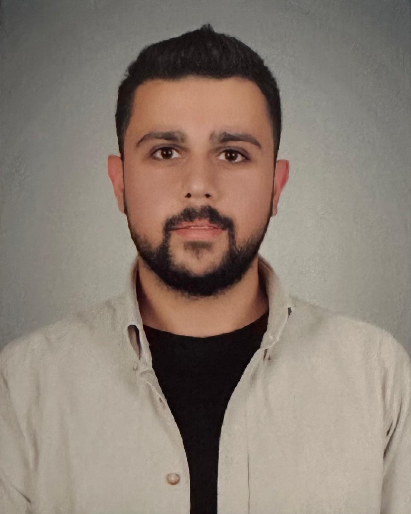

::: {.callout-note appearance="simple"}
Makine mühendisliği altyapısını, üretim tecrübesi ve mühendislik yönetimi bakış açısıyla birleştiriyorum.\
Savunma sanayinde veri odaklı süreç iyileştirme ve üretim optimizasyonu üzerine çalışıyorum.
:::

::: {style="text-align:center; margin-top: 20px;"}
{style="border-radius: 16px;" width="400"}
:::

::: {style="text-align:center; margin-top: 10px; color:#6e6e73;"}
<strong>Erdem Aslanyılmaz</strong>  Senior Production Engineer · MSc Student
:::

------------------------------------------------------------------------

## 🎓 Eğitim

::: {.callout-tip appearance="simple"}
Akademik altyapım, mühendislik ve yönetim disiplinlerinin birleşimine dayanmaktadır.
:::

-   **Hacettepe Üniversitesi**\
    Mühendislik Yönetimi (Yüksek Lisans) \| 2026 – Devam Ediyor

-   **Bartın Üniversitesi**\
    Makine Mühendisliği (Lisans) \| 2018 – 2022\
    GNO: 3.06 / 4.00

------------------------------------------------------------------------

## 💼 İş Tecrübesi

::: callout-note
Üretim süreçleri, verimlilik ve operasyonel mükemmellik üzerine yoğunlaşmaktayım.
:::

### AYESAŞ \| Kıdemli Üretim Mühendisi

2024 – Halen

-   Karmaşık üretim süreçlerinin yönetimi\
-   Operasyonel verimlilik stratejilerinin geliştirilmesi ve uygulanması

### Mege Teknik \| Üretim Mühendisi

2022 – 2024

-   Üretim hattı planlama\
-   Teknik çizim kontrolü\
-   İmalat süreçlerinin uçtan uca takibi

------------------------------------------------------------------------

## 🏭 Stajlar

-   **Mege Teknik** — Stajyer Mühendis (2022)

------------------------------------------------------------------------

## 🚀 Projeler

### TÜBİTAK 2209-A

-   Slipiner çeliği üzerine titanyum kaplama ile yeni nesil havacılık malzemesi geliştirme\
-   Proje TÜBİTAK tarafından desteklenmiştir

### Elektrikli Araç Projesi — Bartın Teknoloji Kulübü

-   Elektrikli araç tasarımı ve mekanik entegrasyon\
-   Karbon fiber dış kabuk tasarımı ve üretimi

------------------------------------------------------------------------

## 🧠 Yetkinlikler

::: {layout-ncol="2"}
-   **CAD/CAM:** Siemens NX, Catia, SolidWorks, AutoCAD\
-   **Ofis Araçları:** MS Excel (İleri Seviye), MS Office
:::

------------------------------------------------------------------------

## 🎯 Hobiler

-   Kültür & Sanat: Müzik, Tiyatro\
-   Spor: Amatör branş sporları

## 🌐 Sosyal Medya

-   💼 [LinkedIn](https://tr.linkedin.com/in/erdem-aslany%C4%B1lmaz-b51819172?trk=public_profile_browsemap)
-   💻 [GitHub](https://github.com/erdemaslanyilmaz)

## 📄 CV

::: {style="text-align:center; margin-top:20px;"}
<a href="assets/cv.pdf" download
style="background-color:#1d1d1f; color:white; padding:12px 24px; text-decoration:none; border-radius:10px;"> CV'yi indir </a>
:::

------------------------------------------------------------------------

::: {style="text-align: right; margin-top: 50px; color: #8e8e93; font-size: 14px;"}
<strong>Erdem Aslanyılmaz</strong>  MÜY665 - İş Analitiği  2026
:::
